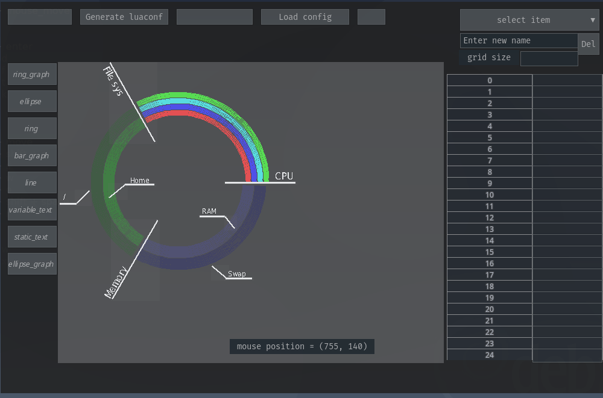

# ConkyLuaMakerGUIv2

A python tkinter GUI to create a Lua conf file for fisadev/conky-draw

written in python3 using : 
  - pygame (pygame.draw)
  - pygame-gui

developped and tested on debian gnu/linux only
(uglier but better version than the last one)

Usage :

    0) run : "python3 conky_lua_maker_main.py"

    1) Create a new object (ring graph, bar graph, text) :
        - hit a button of the left panel
        - programm now wait for an input on draw surface to now where to plot the new figure
          (cicle, ellipse, bar wait for 2 inputs, text for 1)
      
          => now, you should see your object and a new element in the top right list that is prompted "select item"
    
    2.1) Select an object :
      There is 3 ways to select an object :
            - create an object : it's directly "selected"
            - hit with left mouse button an object on the preview panel (make it move too)
            - select an object in the top right drop-downlist
            
            => as you do this, you should see the right panel update
    
    2.2) Edit object properties :
      On the right part of the interface is displayed the selected object properties :
        - you can change any value and hit enter key to validate, graph will update
        - you can, drag direclty an object with the mouse, a left click on an object will make it follow the mouse, 
        a second click release it. properties will update while drawing is moving (position for example)
        - you can (and should) rename object with the entry box to better identify them 
        (the program can't discriminate yet between two object with the same name, so it's better to rename them each time you create one for now)
        - you can delete the selected object by hitting 'Del" button on the top right corner.

    3) Saving and Loading configuration files :
      On the top bar of the interface you get some menu buttons (no a lot yet, I know) :
        - "Generate Lua Conf" button will create the configuration file : "conky_draw_config.lua" needed in fisadev/conky-draw project 
        - "Load" will read this same file and create a preview from it, that you can continue tu edit.
      
    4) You should have notice an entry box named "grid size",for each object/drawing,
    you can give an integer to make the grid more coarse so it's easier to place/align object on the graph with the mouse,
    once given, the value is saved but not displayed, you can give a different value to each object.

    Notes :
        I'm still learing python, the main aim of this project is for me to familiarise with python and GUI, so, code looks quite ugly, 
        Script don't handle exception and can be broken easily (take care of value, don't try to much exotic things),
        so you have to keep all ' and { or 0x of the properties if you don't want to go back to the start
        hope you can create a conf file with not much problems, but it works : 
        
        I've recently change code and dependancy from matplotlib to pygame,
        code now running better, exception are still not handled but, you can save your work and load it more easily now, 
        so you don't have to restart from the start each time you find a bug. 
        graph are also more accurate, and preview look more like it will be displayed by the conky

